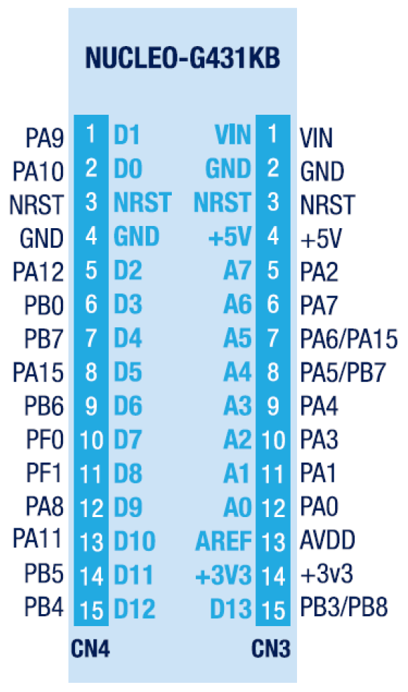

[](https://github.com/jasonyang-ee/STM32G431KB/actions/workflows/build-all.yml)

# STM32G431 Playground

## Hardware Basics

Project Using STM32G431KB as Example. Test hardware is NUCLEO-G431KB.

STM32CubeMX File Included.

Hardware using jumper pin only to test out all functionalities.


## Build This Project

More Docker Details: https://github.com/jasonyang-ee/STM32-Dockerfile

- Docker Build
```
docker run -v "{Your_Local_Full_Path}":"/home" jasonyangee/stm32_ubuntu:latest https://github.com/jasonyang-ee/STM32G431KB
```
> Visit Here for More Details: https://github.com/jasonyang-ee/STM32-Dockerfile


- Manual Build
```
cmake -B build -G Ninja
cmake --build build
```


## Pin Map

Use /CubeMX/CubeMX.ioc for complete info





## Folder Structure

This project uses HAL. Code generation using CubeMX, and the generated code structure is untouched for `/Core` `/Driver` `/Middlewares`.

The only modification is that `main.c` and `main.h` are moved into `/Application` for better workflow.

The c++ layer is done in `/Application`. All c++ class object are to represent each device or feature. Then, all objects are decleared globally in `Instances.hpp`. This will allow controlling class (State Machine or FreeRTOS) to easily access those instances and mutate data.


## SerialCOM

Serial COM is the base of all debugging and user interface for this project. It is used in interrupt mode only. DMA is not necessary because of my string buffer.

A STL string buffer is used to cache all pending to send data. This is gambling on that all data will be send on a fast scheduler to minimize the risk of stack overflow.

This is really convineant that one do not have to worry about data size to exceed TX buffer size.

The receiving buffer size is the only thing must be pre-determined which is easy. That is just your command max length.

In short, both RX and TX buffer size are share defined as below.

> SerialCOM.hpp
```c++
#ifndef UART_BUFFER
#define UART_BUFFER 64
#endif
```

A better practice maybe using [ETL library](https://www.etlcpp.com/) where string max size can be defined. But, whatever.


## LED

LED is the last debugging interface. Running it in breathing / blink / rapid mode will help you to determine if system is at fault.

And it is fun to stare at LED anyway.


## CLI

I am using lwshell. Credit to https://github.com/MaJerle/lwshell

Additionally, I made a c++ wrapper class to use lwshell.

This is how you do all the functions and use this hardware as playground. All playground feature should be accessed via this Command Line Interface.

CLI input and output using UART (SerialCOM) as described above.

To expend commands:
1. Add a static function that returns its run result
```c++
static int32_t led(int32_t, char**);
```
2. Register this function to be called when command is parsed in the RX.
```c++
lwshell_register_cmd("led", &CLI::led, NULL);
```
3. Complete your command function. REMEMBER TO RUTURN SOMETHING ELSE SYSTEM WILL GET STUCK.


## FreeRTOS

Still learning. TBD.

Just kindding.

Alright, I made a c++ wrapper class to use FreeRTOS. That's the main idea here.

To expend your task:
1. Define the task handler and function
```c++
TaskHandle_t parse_Handle;
void parse();
```
2. Use lamda to create the task
```c++
auto t1 = [](void *arg) { static_cast<Thread *>(arg)->parse(); };
xTaskCreate(t1, "cli parsing", 256, this, -2, &parse_Handle);
```
3. Trap the task into its own tiny while() like the one in your main()
```c++
void Thread::parse() {
    while (1) {
		vTaskSuspend(NULL);
        cli.parse();
    }
}
```
4. Use task control (i.e. queue, notify, suspend, resume) to run your app and feature.
```c++
xTaskResumeFromISR(thread.parse_Handle);
```