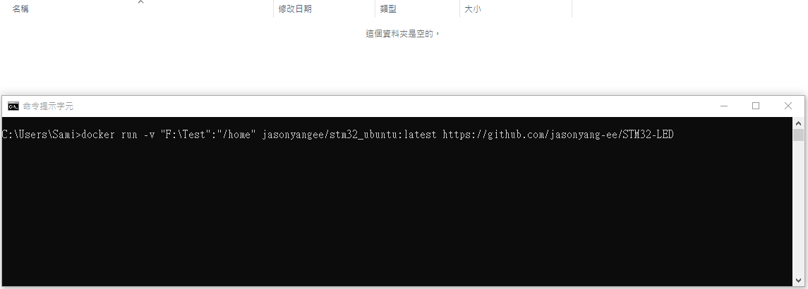
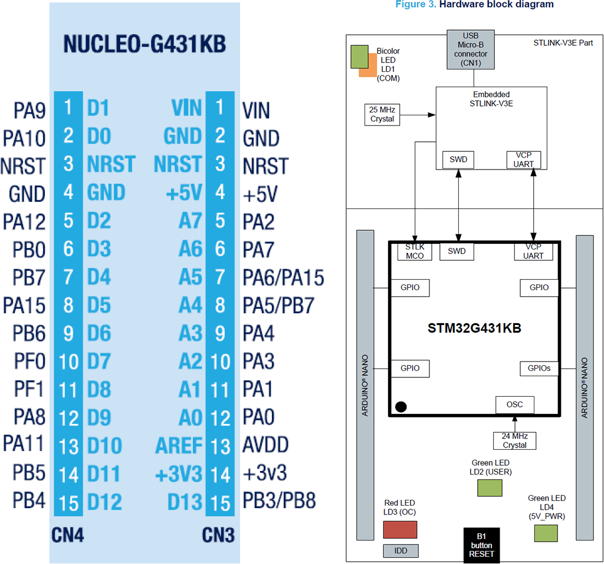

[](https://github.com/jasonyang-ee/STM32G431KB/actions/workflows/build-all.yml)

# STM32G431 Playground

## Documentation

Visit [Documentation](http://doc.jasony.org/STM32G431KB) for more information.

## Hardware Basics

Project Using STM32G431KB as Example. Test hardware is NUCLEO-G431KB.

STM32CubeMX File Included.

Hardware using jumper pin only to test out all functionalities.


## Build This Project

More Docker Details: https://github.com/jasonyang-ee/STM32-Dockerfile

- Docker Build
```
docker run -rm -v {Your_Local_Full_Path}:/home jasonyangee/stm32-builder:ubuntu-latest -r https://github.com/jasonyang-ee/STM32G431KB
```
> Visit Here for More Details: https://github.com/jasonyang-ee/STM32-Dockerfile


- Manual Build
```
cmake -B build -G Ninja
cmake --build build
```


## Pin Map

Use /CubeMX/CubeMX.ioc for complete info




## Folder Structure

This project uses HAL. Code generation using CubeMX, and the generated code structure is untouched for `/Core` `/Driver` `/Middlewares`.

The only modification is that `main.c` and `main.h` are moved into `/Application` for better workflow.

The c++ layer is done in `/Application`. All c++ class object are to represent each device or feature. Then, all objects are decleared globally in `Instances.hpp`. This will allow controlling class (State Machine or FreeRTOS) to easily access those instances and mutate data.


## SerialCOM

Serial COM is the base of all debugging and user interface for this project. It is used in interrupt mode only. DMA is not necessary because of my string buffer.

A STL string buffer is used to cache all pending to send data. This is gambling on that all data will be send on a fast scheduler to minimize the risk of stack overflow.

This is really convineant that one do not have to worry about data size to exceed TX buffer size.

The receiving buffer size is the only thing must be pre-determined which is easy. That is just your command max length.

In short, both RX and TX buffer size are share defined as below.

> SerialCOM.hpp
```c++
#ifndef UART_BUFFER
#define UART_BUFFER 64
#endif
```

A better practice maybe using [ETL library](https://www.etlcpp.com/) where string max size can be defined. But, whatever.


## LED

LED is the 2nd debugging interface. Running it in breathing / blink / rapid mode will help you to determine if system is at fault.

And it is fun to stare at LED anyway.


## CLI

I am using lwshell. Credit to https://github.com/MaJerle/lwshell

Additionally, I made a c++ wrapper class to use lwshell.

This is how you do all the functions and use this hardware as playground. All playground feature should be accessed via this Command Line Interface.

CLI input and output using UART (SerialCOM) as described above.

To expend commands:
1. Add a static function that returns its run result
```c++
static int32_t led(int32_t, char**);
```
2. Register this function to be called when command is parsed in the RX.
```c++
lwshell_register_cmd("led", &CLI::led, NULL);
```
3. Complete your command function. REMEMBER TO RUTURN SOMETHING ELSE SYSTEM WILL GET STUCK.


## FreeRTOS

Still learning. TBD.

Just kindding.

Alright, I made a c++ wrapper class to use FreeRTOS. That's the main idea here.

To expend your task:
1. Define the task handler and function
```c++
TaskHandle_t parse_Handle;
void parse();
```
2. Use lamda to create the task
```c++
auto t1 = [](void *arg) { static_cast<Thread *>(arg)->parse(); };
xTaskCreate(t1, "cli parsing", 256, this, -2, &parse_Handle);
```
3. Trap the task into its own tiny while() like the one in your main()
```c++
void Thread::parse() {
    while (1) {
		vTaskSuspend(NULL);
        cli.parse();
    }
}
```
4. Use task control (i.e. queue, notify, suspend, resume) to run your app and feature.
```c++
xTaskResumeFromISR(thread.parse_Handle);
```


## Flash

The goal is to save and load user configurations for application. Writting from the back of the flash memory.

Porting to different hardware requires user to edit `Flash.hpp` and `Flash.cpp`

Refer to the Reference Manual and find out the end of flash address. Then, update those two variable.

```c++
// G432KB has 128Kb of flash
// Same as (0x0803FFFF + 1 - 0x8); if using datasheet provided value
const uint32_t m_address_end{0x08040000 - 0x8};
const uint8_t m_page_total{127};
```


The configuration data are packaged into a struct and union aligned to `uint64_t array` for double word HAL flash writing function. The pack and unpack is done manually by user.

You will need to edit this section to fit your application needs.

```c++
// Edit config_arr_size and Config content.
#define config_arr_size 2
union Config_Arr {
	struct Config {
		uint32_t led_level;
		uint32_t led_scale;
	} config;

	uint64_t config_arr[config_arr_size];
};
```

In the public function `Save()` and `Load()`, you will need to manually pack and unpack your configuration to/from each of your instances.

Then, you will call the private function `Write()` and `Read()` to do flash access.

Below example saves and loads two configuration from LED usage.

```c++
void Flash::Save() {
    Flash::Config_Arr current_config{};
    current_config.config.led_level = led_user.getLevel();
    current_config.config.led_scale = led_user.getScale();
    Write(current_config.config_arr, config_arr_size);
}

void Flash::Load() {
    Flash::Config_Arr loaded_config{};
    Read(&loaded_config, config_arr_size);
	led_user.setLevel(loaded_config.config.led_level);
    led_user.setScale(loaded_config.config.led_scale);
}
```

The memory save example:


## DAC

DAC using interrupt mode as of now.

Two function is required to run with HAL:
- HAL_DAC_Start(m_port, m_channel);
- HAL_DAC_SetValue(m_port, m_channel, m_alignment, count_value);

`HAL_DAC_Start()` will call `HAL_Delay()`, and if used before `vTaskStartScheduler()`, then it will mess up with FreeRTOS causing thread to stuck in loop.

Solutin is to move `HAL_DAC_Start()` into `setState()`. But, this likey will cause minor delay in runtime since every change of DAC value will call `HAL_DAC_Start()` again.

Later we should implement a DMA or RTOS init() thread to be run once on system boot.


## ADC

ADC value not matching to DAC value. Investigation needed.