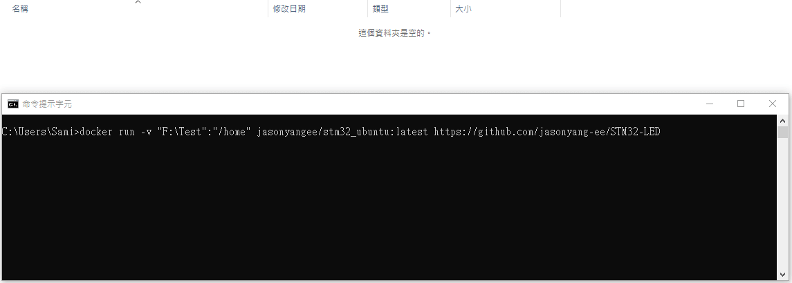
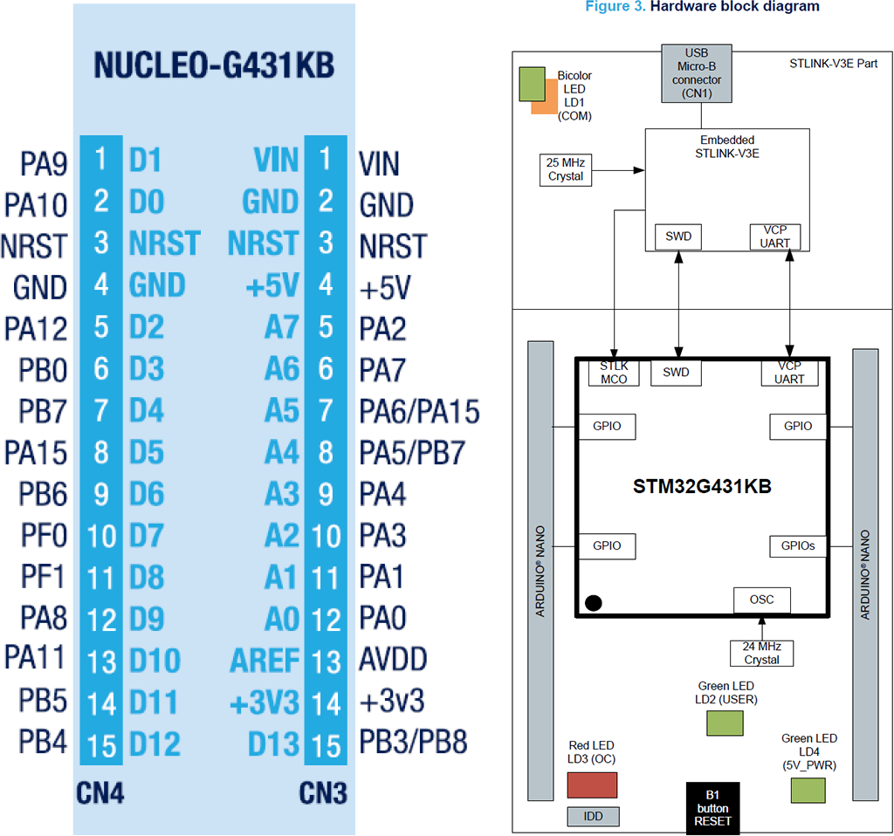
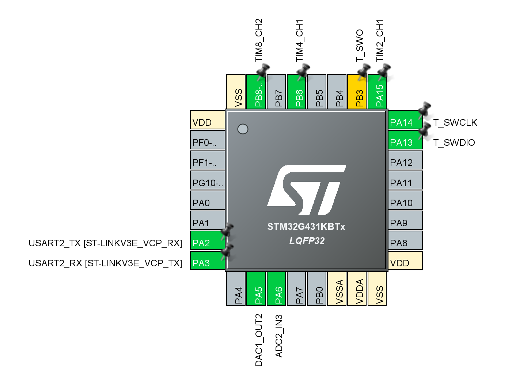

# Introduction


## Hardware Basics

Project Using STM32G431KB as Example. Test hardware is NUCLEO-G431KB.

STM32CubeMX File Included.

Hardware using jumper pin only to test out all functionalities.


## Build This Project

More Docker Details Visit <https://github.com/jasonyang-ee/STM32-Dockerfile>

- Auto Docker Build Command
	```
	docker run -rm -v {Your_Local_Full_Path}:/home jasonyangee/stm32-builder:ubuntu-latest https://github.com/jasonyang-ee/STM32G431KB
	```
	> 

- Manual CMake Build Command
	```
	cmake -B build -G Ninja
	cmake --build build
	```


## Pin Map

Use /CubeMX/CubeMX.ioc for complete info





## Folder Structure

This project uses HAL. Code generation using CubeMX, and the generated code structure is untouched for `/Core` `/Driver` `/Middlewares`.

The only modification is that `main.c` and `main.h` are moved into `/Application` for better workflow.

The c++ layer is done in `/Application`. All c++ class object are to represent each device or feature. Then, all objects are decleared globally in `Instances.hpp`. This will allow controlling class (State Machine or FreeRTOS) to easily access those instances and mutate data.


